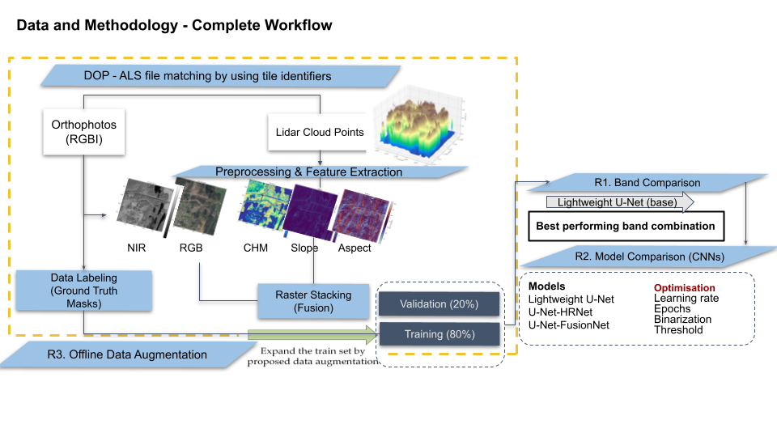
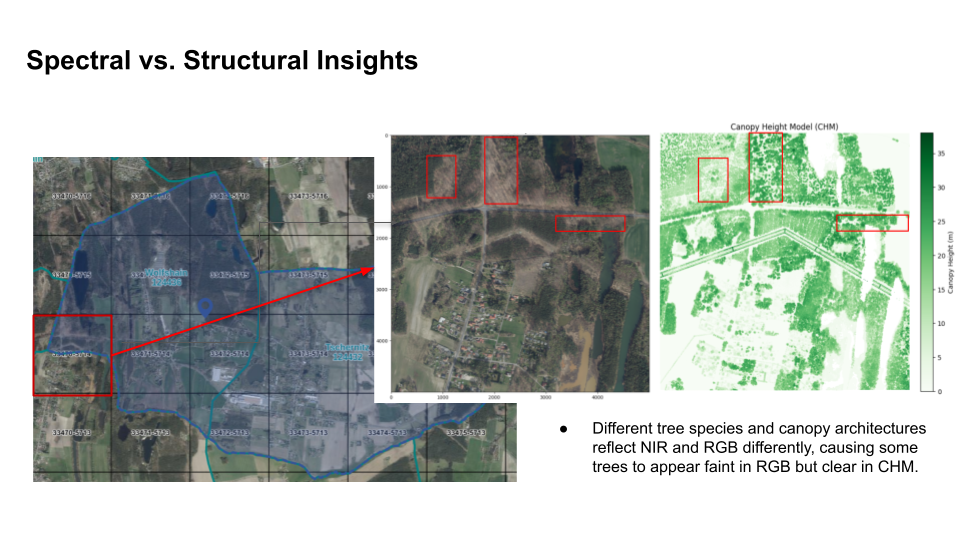

# Evaluating the Impact of Data Augmentation on Forest Segmentation Using Aerial Imagery and LiDAR data

**Author:** Aylin Gülüm  
**Institution:** Hochschule für Technik und Wirtschaft Berlin (HTW Berlin)  
**Program:** M.Sc. Project Management & Data Science  
 

---

## Abstract

This thesis examines how data augmentation and multimodal feature integration influence the performance of deep learning models for forest segmentation using high-resolution aerial imagery and LiDAR data. The study integrates RGBI orthophotos with LiDAR-derived structural layers—including canopy height, elevation, slope, and aspect—to evaluate how spectral and structural information jointly contribute to more accurate and generalizable segmentation outcomes. A standardized preprocessing pipeline was developed to align and fuse these heterogeneous datasets and to generate ground-truth masks using a hybrid SAM-assisted and manually refined approach.

Three segmentation architectures **U-Net**, **U-Net-HRNet**, and **U-Net-FusionNet** trained under a range of augmentation strategies to assess their sensitivity to multiscale vegetation patterns and spatial heterogeneity.
Three architectures were compared under various augmentation strategies to assess performance on high-resolution forest segmentation tasks.

## 🧪 Research Questions

**RQ1 — Multimodal Contribution**  
Does LiDAR-derived structural information improve segmentation quality compared to RGBI-only input?

**RQ2 — Architectural Sensitivity**  
How do different U-Net-based architectures respond to multimodal fusion?

**RQ3 — Augmentation Robustness**  
Which augmentation strategies improve generalization under spatial and spectral variability?

**RQ4 — Spatial Generalization**  
How well do models generalize across geographically distinct forest tiles?

---

## Repository Structure

masters_docs/

notebooks/                     # Jupyter notebooks for exploration and preprocessing
-    ├── Experiments.ipynb         # Experiment notebooks with model evaluation
-    ├── exploration_las_files.ipynb  # Exploration of LiDAR LAS files
-    ├── preprocess_data.ipynb    # Data preprocessing pipeline
-    └── samgeo_ground_truth.ipynb # Ground-truth mask exploration

utils/                         # Utility scripts for augmentation and preprocessing
-    ├── augmentation_pipeline.py  # Data augmentation functions
-    ├── get_file_matches.py       # Helper for file matching
-    ├── load_train_eval.py            # Script for loading, training, and evaluating models
-    ├──    models.py  # Deep learning models (Unet and derivatives)
-    ├── preprocess_and_stack.py   # Functions for preprocessing and stacking inputs

README.md                        # Project documentation

requirements.txt                 # Python dependencies

---

## Experiment Reproduction

The primary experiment and evaluation workflow is available in:

[**notebooks/Experiments.ipynb**](notebooks/Experiments.ipynb)

This notebook contains:
- Band-combination experiments (RGB, RGBI, RGBI + CHM, etc.)
- Model comparison experiments (U-Net, HRNet-inspired, FusionNet-inspired)
- Augmentation evaluations
- Metric computation and validation workflows
- Visualization of segmentation outputs and probability maps

The outputs included in the notebook represent rerun experiments performed after thesis submission as part of ongoing reproducibility validation and repository refactoring. Consequently, some metrics may differ slightly from the archived thesis results reported in the thesis manuscript and presentation.

## 🧱 System Overview

1. Raw LiDAR (.LAS/.LAZ) + orthophotos (RGBI)
2. LiDAR rasterization → DEM / DSM / CHM
3. Feature alignment with orthophoto grid
4. Multimodal stacking (RGBI + LiDAR features)
5. Dataset tiling + augmentation
6. Deep learning training (U-Net variants)
7. Evaluation under spatial holdout split

---

Below is the complete workflow summarizing data acquisition, preprocessing, feature extraction, model training, and evaluation.

  

## Dataset and Methods

### 1. **Study Area and Data Sources**

### Dataset

**Region:** Tschernitz, Brandenburg (Germany)  
**Data Source:** [Landesvermessung und Geobasisinformation Brandenburg (LGB)](https://geobasis-bb.de)  
**Portal:** [GeoPortal Brandenburg – Open Data](https://geoportal.brandenburg.de)  
**License:** *Datenlizenz Deutschland – Namensnennung – Version 2.0 (dl-de/by-2-0)*  

   - Study region: Tschernitz (1 km²), eastern Germany  
   - RGBI orthophotos provided by Geobasis Brandenburg (TrueDOP)  
   - LiDAR point clouds (Airborne Laser Scanning, LAS 1.4, Point Format 6)  
   - RGBI specifications:  
     - Spatial resolution: 0.2 m × 0.2 m  
     - Spectral bands: Red, Green, Blue, Infrared  
     - Acquisition date: 07 April 2024  
     - Publication date: 09 August 2024  
   - LiDAR specifications:  
     - Point density: 5 points/m²  
     - Acquisition date: 08 January 2023  
     - Publication date: 28 November 2023  
     - Attributes include spatial coordinates, intensity, classification, return information, scan angle, and GPS time  
   - The ~455-day temporal difference between RGBI and LiDAR is acceptable due to stable forest canopy structure in the region.

### 2. **Data Preprocessing & Feature Extraction**  
   - Rasterization of raw LiDAR point clouds without point removal  
   - Generation of:  
     - Digital Elevation Model (DEM)  
     - Canopy Height Model (CHM)  
     - Slope  
     - Aspect  
   - Initial rasterization at 1 m resolution due to memory limitations  
   - Bicubic upscaling of LiDAR-derived rasters to 5000 × 5000 pixels to match RGBI orthophotos  
   - Co-alignment and merging of RGBI and LiDAR layers into 20 multimodal raster stacks (each representing a 1 km² tile)

  

Differences between spectral and structural representations reveal important characteristics of forest composition.  In RGB imagery, certain tree species or sparse canopy structures may appear faint or visually ambiguous. The Canopy Height Model (CHM), however, clearly highlights these same trees due to their elevation and structural form. This divergence indicates that relying solely on spectral information may lead to under-segmentation of tall or sparsely foliated trees, while the integration of LiDAR height data improves separability.

### 3. **Ground-Truth Label Generation**  
   - Use of the Segment Anything Model (SAM) with a prompt-based approach  
   - Orthophotos divided into 1024 × 1024 px patches and processed with the prompt “forest”  
   - Adjustment of SAM box/text thresholds to refine segmentation quality  
   - Manual correction of tiling artifacts using GIMP  
   - Final masks compiled into full-tile ground-truth segmentation layers

### 4. **Data Partitioning, Spatial Structure, and Class Balance**  
   - Each multimodal tile (5000 × 5000 px) resized to 256 × 256 px (≈3.9 m per pixel)  
   - Full-tile resizing used instead of patch-based tiling to preserve spatial continuity  
   - Spatial holdout split used to prevent geographic leakage:  
     - 80% training tiles  
     - 20% validation tiles (geographically distinct subset)  
   - Stratified variant evaluated due to forest-cover imbalance:  
     - Original forest coverage: 30.5% (train), 53.0% (val)  
     - After stratification: 31.0% (train), 50.6% (val)  
   - Combined Dice + Binary Cross-Entropy loss applied to mitigate imbalance during training

### 5. **Model Architectures**  

  

   - Three U-Net–based convolutional neural network architectures were implemented to evaluate the impact of structural and spectral feature integration.  
   - **Baseline U-Net:**  
This is the basic U-Net with three encoding levels. Each convolution block doubles the filters while the spatial dimensions halve at each pooling layer. The decoder mirrors the encoder, upsampling and concatenating feature maps from the encoder path (shown as dashed lines).
     - Lightweight variant with reduced convolutional filters  
     - Depthwise-separable convolutions for efficiency  
     - Standard encoder–decoder structure with skip connections  

   - **U-Net-HRNet (HRNet-Inspired):**  
The HRNet with Attention U-Net adds a Squeeze-and-Excitation (SE) block after each convolutional layer. Each SE block uses global average pooling followed by two dense layers to learn channel-wise attention weights, allowing the network to adaptively recalibrate the importance of different features. This has four encoding levels (64→128→256→512 channels) compared to the basic model's three.

     - Incorporates high-resolution feature retention principles  
     - Integrates Squeeze-and-Excitation (SE) blocks for channel-wise attention  
     - Designed to preserve fine spatial detail lost during downsampling  

   - **U-Net-FusionNet (FusionNet-Inspired):**  
The Improved FusionNet U-Net replaces all convolution blocks with residual blocks. Each residual block contains its own internal skip connection (the thin dashed lines within each block) that adds the input directly to the output after two convolutions. If channel counts don't match, a 1×1 convolution adjusts the shortcut. This allows deeper networks to train more effectively and helps with gradient flow during backpropagation.

     - Includes residual connections in both encoder and decoder  
     - Enhances gradient flow and multimodal feature propagation  
     - Improves stability when integrating RGBI and LiDAR-derived features  

**Key differences between the models:**
- Basic U-Net: Simplest architecture, plain convolutional layers. Good baseline for segmentation tasks.
- HRNet with Attention U-Net: Adds Squeeze-and-Excitation blocks that learn channel-wise attention. Deeper (4 encoding levels instead of 3), each SE block helps the network focus on important feature channels.
- Improved FusionNet: Uses residual blocks throughout. Internal skip connections in each residual block improve gradient flow and training stability. Works well when you need deeper models or have limited training data.

   - All models were trained using aligned, multimodal raster stacks and evaluated consistently across splits.

  

 

Training Setup
- Bands: RGBI + CHM (best from Experiment 1)
- Custom Dice + BCE loss for class imbalance
- Batch size 4, epochs 50, LR sweep 10⁻²→10⁻⁶

Learning Rate Selection
- Lowest test loss at 10⁻⁴ for all models

  

Convergence Behavior
• Rapid loss drop in first 20 epochs, then plateau
• 50 epochs chosen to balance convergence vs. overfitting

Threshold Tuning (IoU vs. Thresh.)
• Peak IoU at 0.4–0.5 for all models

---

### 6. **Augmentation Strategy**  
   - Offline data augmentation used to expand the diversity of training samples.  
   - Augmentation types included:  
     - Geometric transformations (rotation, horizontal/vertical flips, random scaling)  
     - Photometric adjustments (brightness and contrast shifts)  
     - Noise-based augmentations (Gaussian noise, salt-and-pepper noise)  
     - Spectral dropout applied selectively to multispectral channels  
   - Augmentations were parameterized to avoid unrealistic forest representations while improving model generalization.

---

### 7. **Evaluation Metrics**  
   - Performance was assessed using commonly adopted segmentation metrics:  
     - **Intersection over Union (IoU):** Measures overlap between predicted and true masks.  
     - **Dice Coefficient:** Favors foreground classes and balances precision–recall interactions.  
     - **Precision and Recall:** Evaluate omission and commission errors in forest detection.  
   - Validation results were computed across spatially distinct tiles to ensure geographic generalization.

---

### 8. **Limitations**  
   - Temporal differences between RGBI and LiDAR datasets (~455 days) may introduce subtle inconsistencies despite stable canopy conditions.  
   - Upscaling LiDAR rasters to match RGBI resolution can smooth fine structural variations.  
   - Ground-truth masks generated via SAM required manual refinement to correct tiling artifacts.  
   - Forest coverage imbalance between tiles required stratification and loss-function adjustments.  
   - Performance may vary across forest types or seasons not represented in the dataset.

---

<<<<<<< Updated upstream
### 9. **Results Overview**  
* **Multimodal Contribution (Band Comparison):** Integrating LiDAR-derived structural features notably improves segmentation accuracy compared to spectral-only data. For the lightweight U-Net baseline:
    * Moving from **RGB** (IoU: 69.1%) to **RGBI** yields a modest boost of 1.3 percentage points (IoU: 70.4%).
    * Adding the Canopy Height Model (**RGBI + CHM**) provides the most significant performance leap, driving IoU up to **75.1%** (a total increase of 6.0 percentage points from RGB, and an increase from 69.1% to 75.1% for IoU and 75.5% to 81.8% for Dice). 
    * The inclusion of further topographical layers (Slope and Aspect) beyond the CHM results in negligible performance gains (**RGBI + CHM + Slope** centers around 75.0% IoU).

* **Architectural Sensitivity & Convergence:** All three U-Net architectures demonstrate stable convergence behaviors within 100 epochs, with a rapid loss drop in the first 20 epochs followed by a steady plateau around 0.12–0.15.
    * **U-Net-FusionNet** (incorporating residual connections) exhibits the fastest and most stable convergence, achieving the lowest overall training and testing loss values early on and maintaining low test loss variability.
    * **U-Net-HRNet** (incorporating channel-wise Squeeze-and-Excitation attention) shows slightly higher training and testing loss variations during the early epochs but stabilizes effectively after epoch 25.

* **Data Augmentation Sensitivity:** The architectures react differently to geometric and photometric transformations, indicating that augmentation intensity must be carefully tailored to structural depth:
    * **Lightweight U-Net:** Benefits consistently from simple geometric flips, with **VerticalFlip** boosting its metric to **78.4** (up from 75.3 with no augmentation).
    * **U-Net-HRNet:** Exhibits a high affinity for smoothing and blurring mechanisms rather than spatial distortions. Applying **Blur** yields its highest overall performance score of **80.6** (up from 68.7 with no augmentation).
    * **U-Net-FusionNet:** Demonstrates high baseline robustness without augmentations (77.1), but is severely degraded by aggressive spatial distortions. Applying **Scale** drops its performance sharply to a critical low of **68.6** (highlighted in red), indicating that scaling distortions disrupt its internal residual feature maps. Heavy noise injections (e.g., GaussNoise) universally harm performance across all three models.

## Installation and Reproduction
This project was developed with Python 3.10 and TensorFlow 2.10.

=======
>>>>>>> Stashed changes
Presentation of this thesis is available in the file:  
[**thesis_presentation.pdf**](visuals/thesis_presentation.pdf)
